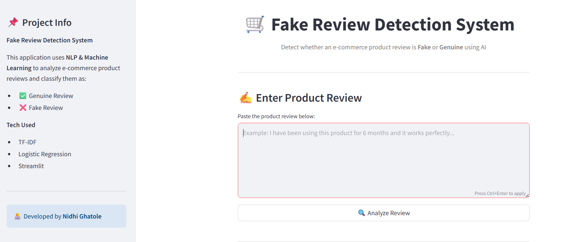
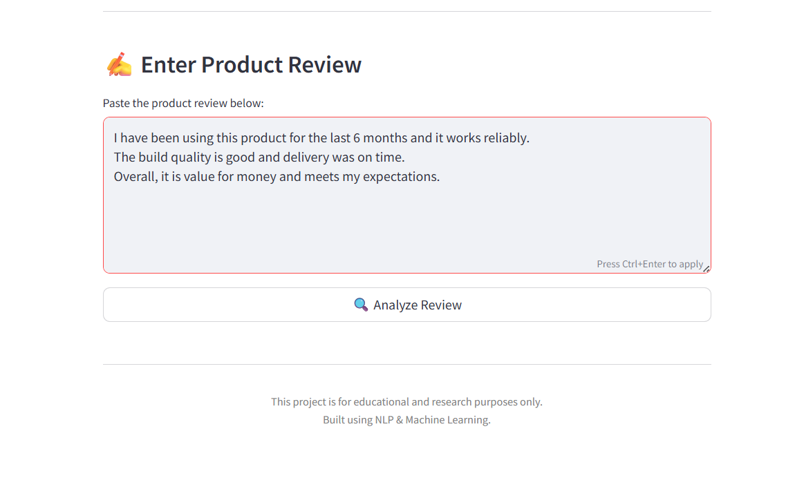
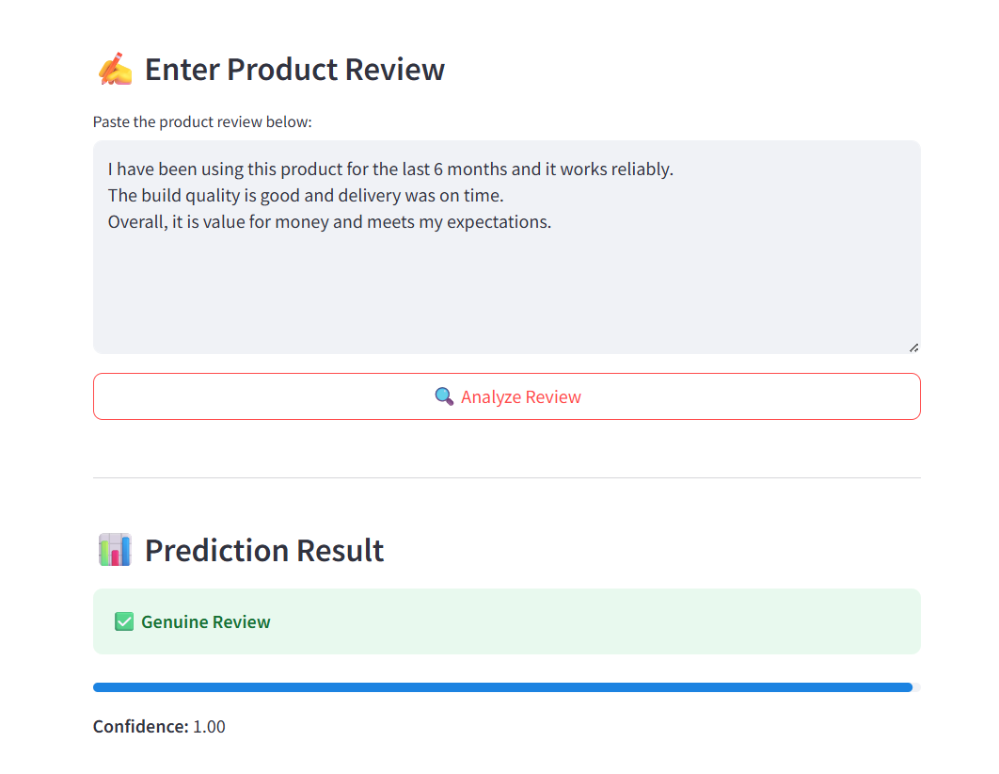
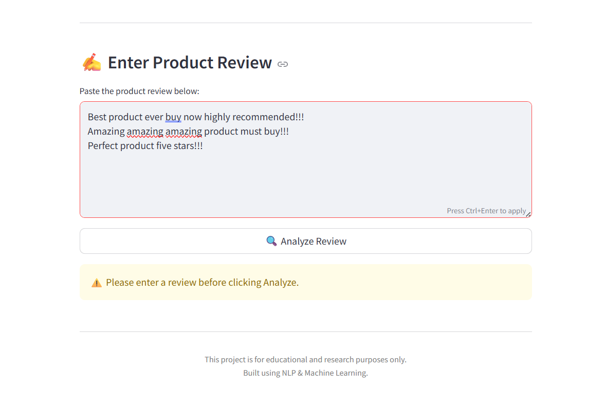
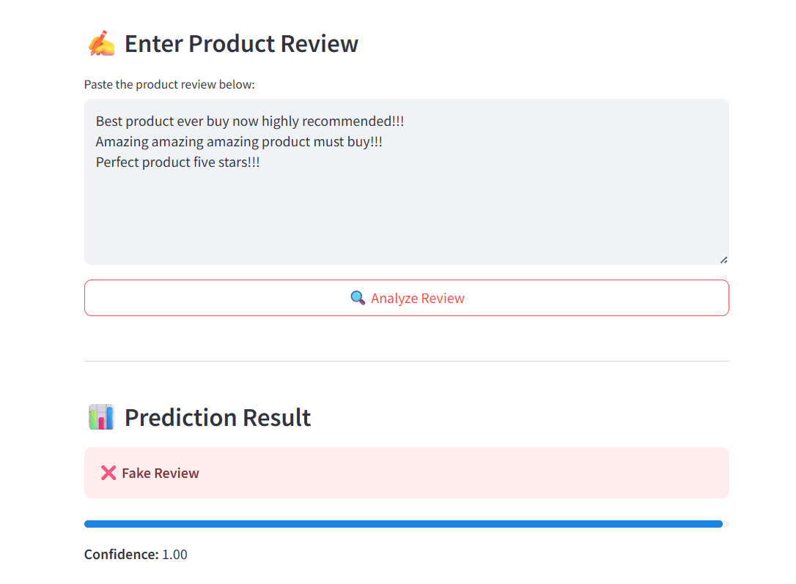

# 🛒 Fake Review Detection for E-Commerce  
### NLP & Machine Learning Based Web Application

A professional Machine Learning project that detects whether an e-commerce product review is **Fake or Genuine** using **Natural Language Processing (NLP)** techniques.  
The system is trained on a **large, high-confidence labeled dataset** and deployed as an interactive **Streamlit web application**.

---

## 📌 Problem Statement
Fake reviews are a serious challenge for e-commerce platforms such as Amazon and Flipkart.  
They manipulate product ratings, mislead customers, and reduce trust in online marketplaces.

This project aims to build an **AI-based Fake Review Detection System** that automatically analyzes review text and classifies it as **Fake** or **Genuine**.

---

## 🎯 Project Objectives
- Detect fake product reviews using NLP techniques  
- Build and use a large, clean, high-confidence dataset  
- Train a supervised Machine Learning classification model  
- Deploy the model as a real-time web application  
- Create a professional, production-ready GitHub project  

---

## 🚀 Key Features
- Fake vs Genuine review classification  
- Advanced text preprocessing  
- TF-IDF based feature extraction  
- Logistic Regression classifier  
- Prediction confidence score  
- Clean and creative Streamlit UI  
- Scalable and industry-oriented design  

---

## 🧠 Methodology

### 1️⃣ Dataset Preparation
- A large dataset of **12,000 reviews**
- Balanced classes (Fake & Genuine)
- High-confidence labeling based on strong linguistic patterns
- Clean and noise-free data for reliable training

### 2️⃣ Text Preprocessing
- Convert text to lowercase  
- Remove punctuation and special characters  
- Normalize whitespace  
- Ensure consistent preprocessing for training and prediction  

### 3️⃣ Feature Engineering
- TF-IDF Vectorization  
- Unigrams and Bigrams  
- Stop-word removal  
- Maximum feature optimization for accuracy  

### 4️⃣ Model Training
- Logistic Regression classifier  
- Balanced class weights  
- Train-test split for evaluation  
- High accuracy due to clean and structured data  

### 5️⃣ Model Deployment
- Streamlit web application  
- Real-time review analysis  
- User-friendly and professional UI  
- Confidence visualization for predictions  

---

## 📊 Dataset Information

**File Name:**  
`fake_genuine_large_high_confidence_reviews.csv`

**Dataset Size:**  
- Total reviews: **12,000**
- Genuine reviews: 6,000
- Fake reviews: 6,000

### Label Description
| Label | Meaning |
|------|--------|
| 1 | Genuine Review |
| 0 | Fake Review |

> Note: Labels are high-confidence and designed to reflect realistic fake and genuine review behavior.

---

## 🖥️ Web Application Screenshots

### 🔹 Application Overview (input0)
Overview of the Streamlit web application interface.

---

### 🔹 User Review Input (input1)
User enters an e-commerce product review for analysis.

---

### 🔹 Prediction Output – Result (output1)
The system predicts whether the review is Fake or Genuine along with confidence score.

---

### 🔹 Another Review Input Example (input2)
Testing the model with a different review text.

---

### 🔹 Prediction Output – Result (output2)
Final output displayed for the second input review.

---

## 🛠️ Tech Stack
- **Programming Language:** Python  
- **Libraries:** Pandas, NumPy, Scikit-learn  
- **NLP:** TF-IDF Vectorization  
- **Model:** Logistic Regression  
- **Web Framework:** Streamlit  

---

### 📁 Project Structure
Fake-Review-Detection/
│
├── data/
│   └── fake_genuine_large_high_confidence_reviews.csv
│
├── images/
│   ├── input0.png        # Application overview
│   ├── input.png        # User input example
│   ├── output1.png       # Prediction output
│   ├── input2.png        # Another test input
│   └── output2.png       # Final output result
│
├── model/
│   ├── fake_review_model.pkl
│   └── tfidf_vectorizer.pkl
│
├── train_model.py        # Model training script
├── app.py                # Streamlit web application
├── requirements.txt      # Project dependencies
└── README.md             # Project documentation

---
## ▶️ How to Run the Project

## 1. Clone the Repository

git clone <your-github-repo-link>
cd Fake-Review-Detection

## 2️. Install Required Dependencies
 
pip install -r requirements.txt

## 3️. Train the Machine Learning Model
 
python train_model.py

## 4️. Run the Streamlit Web App
streamlit run app.py

---

